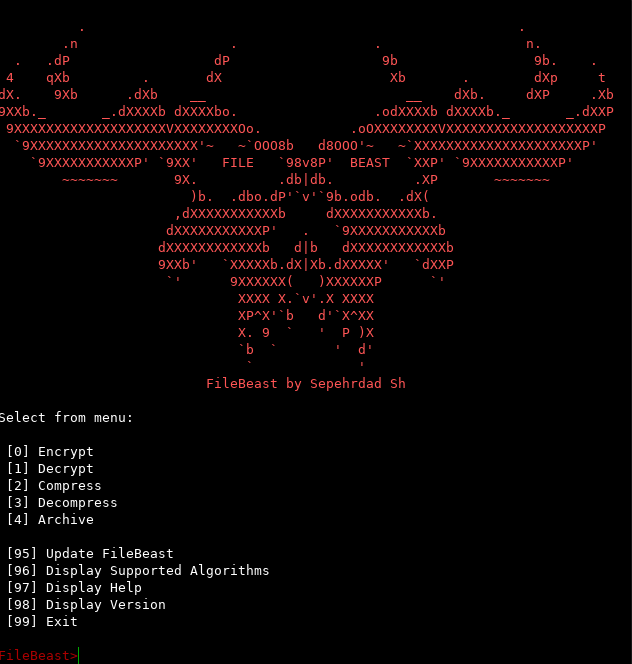

# The FILEBEAST Project #

# README #
__FileBeast__ is an open source application used to __Encrypt or Compress__ Files on the local disk
for many purposes such as: backup and security
It uses __AES,TripleDES and BlowFish__ for Encryption algorithm and __GZIP,BZIP and ZLib__ for Compression and 
__TAR, TAR-GZIP and TAR-BZIP__ for Archiving

<p align="center"></p>


### Who is the developer? ###

FileBeast is developed by sepehrdad sh

### What is this repository for? ###

* FileBeast Python File encryption-compression tool
* ver 1.3.2

### How do I get set up? ###
# A) #
1)  Download ZipFile from : https://github.com/sepehrdaddev/FileBeast/archive/master.zip and extract it or 
    Run `git clone https://github.com/sepehrdaddev/FileBeast.git` in the shell
2)  Install python 2.7
3)  Run `pip install -r requirements.txt` in shell
4)  Run `python FileBeast.py` in shell
# B) #
1)  Download standalone from : https://github.com/sepehrdaddev/FileBeast/releases and extract it

### Usage ###

```
[*] Usage : FileBeast -i <inputfile> -m <method> -a <algorithm> -p <password>/-l <level> -o <outputfile> -d
                -h                      display help
                -v                      display version
                -s                      display supported algorithms
                -u                      update FileBeast
                -i                      input file path
                -I                      input directory path
                -o                      output file path
                -O                      output directory path
                -a                      encryption/compression algorithm
                -m                      set method(encrypt/decrypt/compress/decompress/archive)
                -p                      password for encryption/decryption
                -l                      level for compression(0 to 9)
                -d                      delete original file/directory
        
[*] Supported Encryption Algorithms : 
                                       AES

                                       DES3

                                       BLOWFISH

[*] Supported Compression Algorithms : 
                                       BZIP

                                       GZIP

                                       ZLIB

[*] Supported Archiving Algorithms : 
                                       TAR-GZIP

                                       TAR-BZIP

                                       TAR

[*] Example : FileBeast -i test.txt -m encrypt -a AES -p password123 -o test.txt.enc
[*] Example : FileBeast -i test.txt.enc -m decrypt -a AES -p password123 -o test.txt
[*] Example : FileBeast -i test.txt -m compress -a gzip -l 9 -o test.txt.compressed
[*] Example : FileBeast -I directory/ -m archive -a tar-gzip -o test.txt.tar.gz
[*] Example : FileBeast -i test.txt.compressed -m decompress -a gzip -o test.txt
[*] Example : FileBeast -i test.tar.gz -m decompress -a tar-gzip -O test/

```

### How to Compile ###

## Using pyinstaller
* Download pyinstaller: https://github.com/pyinstaller/pyinstaller
* Create the executable file:`python pyinstaller.py --onefile FileBeast.py`

### For Windows only
* To get a better compatibility between systems, msvcp100.dll and msvcr100.dll could be added. These files could be found in "C:\Windows\System32\". Place it on the root folder of the pyinstaller directory.

* Create a .spec file adding all options wanted. Mine is as follow:

```
# -*- mode: python -*-
import sys
a = Analysis(['FileBeast.py'],
             pathex=[''],
             hiddenimports=[],
             hookspath=None,
             runtime_hooks=None)
for d in a.datas:
  if 'pyconfig' in d[0]: 
    a.datas.remove(d)
    break
pyz = PYZ(a.pure)
exe = EXE(pyz,
          a.scripts,
		  a.binaries + [('msvcp100.dll', 'msvcp100.dll', 'BINARY'),
						('msvcr100.dll', 'msvcr100.dll', 'BINARY')]
		  if sys.platform == 'win32' else a.binaries,
          a.zipfiles,
          a.datas,
          name='FileBeast.exe',
          debug=False,
          strip=None,
          upx=True,
          console=True)

```

* Generate your executable file: `python pyinstaller.py --onefile FileBeast.spec`

